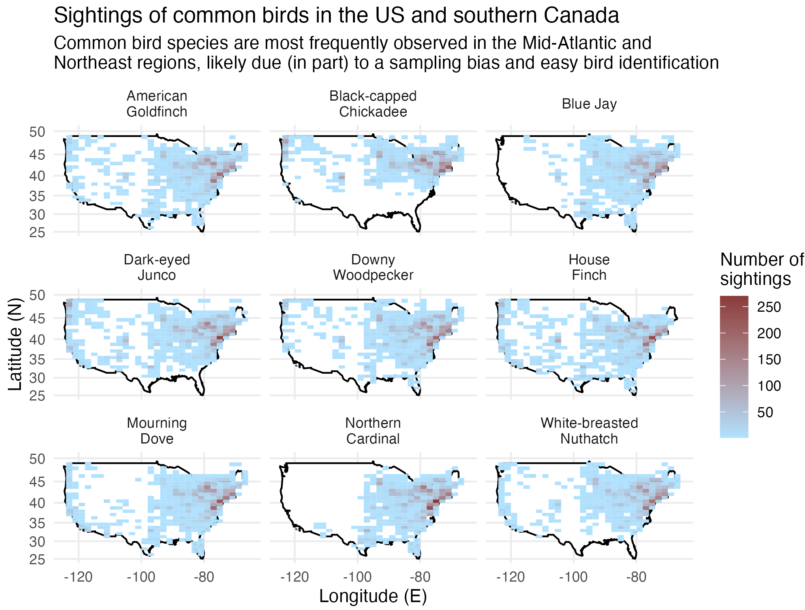

```{r global, include=FALSE}
library(here)
library(tidyverse)
# Load data for dashboard
# List required files to download from TidyTuesday
rds_files <- c("feederwatch.RDS")

# Check if any of these files don't exist
if (any(!file.exists(here("data", rds_files)))) {
  dir.create(here("data"))
# if missing, download the data
feederwatch <- readr::read_csv('https://raw.githubusercontent.com/rfordatascience/tidytuesday/master/data/2023/2023-01-10/PFW_2021_public.csv')

# save the data objects as RDS files
saveRDS(feederwatch, file = here("data","feederwatch.RDS"))
}

# Load data
feederwatch <- readRDS(here("data","feederwatch.RDS"))

# had to save the species_codes dictionary manually from https://docs.google.com/spreadsheets/d/1kHmx2XhA2MJtEyTNMpwqTQEnoa9M7Il2/edit#gid=2040245914
species_codes_dd <- read_csv(here("data","FeederWatch_Data_Dictionary_Species_Codes.csv"),skip = 1)

# Also made a .csv of state birds from data on Wikipedia
state_bird_df <- read_csv(here("data","state_birds_list_plain.csv"))

# Preliminary pre-processing of data:

names(feederwatch) <- tolower(names(feederwatch))
names(species_codes_dd) <- tolower(names(species_codes_dd))

# Make df for state names/abbreviations 
US_state_name_abb <- as.data.frame(cbind(state_abb = state.abb, 'state/province' = state.name))
US_state_name_abb <- rbind(US_state_name_abb,c("DC","Washington, D.C."))

# CA_provinces_abb <- data_df %>%
#  filter(country=='CA') %>%
#   select('state/province') %>%
#   unique() %>%
#   arrange()

CA_province_name <- c("Quebec","Ontario","British Columbia","Manitoba","Nova Scotia","New Brunswick","Prince Edward Island","Newfoundland and Labrador","Alberta","Saskatchewan")
CA_provinces_abb <- c("QC","ON","BC","MB","NS","NB","PE","NL","AB","SK")
CA_province_name_abb <- as.data.frame(cbind(state_abb = CA_provinces_abb, 'state/province' = CA_province_name)) 

US_CA_name_abb <- rbind(US_state_name_abb, CA_province_name_abb)

# Clean data
data_df <- left_join(feederwatch, species_codes_dd, by = "species_code") %>%
  filter(valid == 1,                        # remove "invalid" observations (N = 656)
         category == "species",          # remove birds that weren't identified to the species level (N = 1194)
         latitude >= 20,
         latitude <= 50) %>%
  separate_wider_delim(subnational1_code, "-", names = c("country","state_abb")) %>%
  left_join(US_CA_name_abb, by = "state_abb") %>%
  filter(country == "US" | country == "CA") %>%
  mutate(month=factor(month, levels=c("11","12","1","2","3","4"))) %>%
  select(primary_com_name, 
            sci_name, 
            country,
            `state/province`,
            latitude, 
            longitude,
            month, 
            day, 
            year, 
            how_many)  # remove columns that probably aren't interesting to the public
# Maybe still have too many columns - may want to filter further for data table??

# Check that all US states + DC + Canadian provinces were matched correctly
# state_na_i <- which(is.na(data_df$'state/province')==1)
# data_df[head(state_na_i),]

# Prep maps of America/USA for making figures
america_map <- map_data("world", region='USA')
# USA_map <-
#   ggplot(america_map, 
#          aes(x=long, y=lat, group=group)) +
#   geom_polygon(fill="white",color="black") + 
#   scale_x_continuous(limits = c(-125,-65)) +
#   scale_y_continuous(limits = c(25, 50)) + 
#   coord_map() +
#   theme_minimal()

states_map <- map_data("state")

# state_map <- states_map %>%
#   filter(region == "west virginia") %>%
#   ggplot(aes(x = long, y = lat)) +
#   geom_polygon(fill="white",color="black") +
#   coord_map() +
#   theme_minimal()

```

```{r setup, include=FALSE}
knitr::opts_chunk$set(warning=FALSE, message=FALSE, echo=FALSE)
library(flexdashboard)
library(DT)
library(shiny)
library(lemon)     # pretty tables with kable
```
# About


## Column 

**Project aims**

Let's investigate patterns in abundance and distribution of different species of birds in the 2020-21 winter in the United States and southern Canada.
Specifically, we can examine:

-   when and where are birds observed
-   which species are most common, and where are they found
-   which species tend to occur in large flocks, and where are they found

This analysis is intended for the general public, as well as the citizen scientists (and the graders for Biostat 777).


### Chart A

```{r}

```

## Column {data-width=350}

### Chart B

```{r}

```

### Chart C

```{r}

```

# Data 

## Column 
These data were discovered via [TidyTuesday for January 10, 2023](https://github.com/rfordatascience/tidytuesday/tree/master/data/2023/2023-01-10), but originally come from [Project FeederWatch](https://feederwatch.org/).
Project FeederWatch is a citizen science project that aims to engage individuals in North America to count birds (for as long or as little as they like) to track winter trends in bird distribution and abundance.
This project has been running for more than 30 years at this point!
The data dictionary is available [here](https://drive.google.com/file/d/1kHmx2XhA2MJtEyTNMpwqTQEnoa9M7Il2/view).


```{r}
DT::renderDataTable({
  DT::datatable(data_df,
                caption = htmltools::tags$caption(
                  style = 'caption-side: top; text-align: Left;'),
                options = list(autoWidth = TRUE,
                               pageLength = 10,
                               scroller = TRUE,
                               scrollY = '450px'))
})
```


# Common birds

## Column {data-width="50"}

### Top 10 most common birds
```{r , render=lemon_print}
# Table of most common birds

commonly_sighted_birds_table <- data_df %>%
  group_by(sci_name, primary_com_name) %>%
  summarize(total = sum(how_many),
            count = n()) %>%
  arrange(desc(count)) %>%
  head(n=10) %>%
  select('Common name' = primary_com_name,
         'Scientific name' = sci_name,
         'Number of observations' = count)
commonly_sighted_birds_table

```

## Column {data-width="50"}
### Sighting numbers and locations
```{r, eval=FALSE}
# Figure 4: Commonly sighted birds
# Since this figure takes a long time to render, we'll just load in the saved figure below, but this is the code that was used to generate it:
  
common_birds_plot <- USA_map +
  geom_bin_2d(data = commonly_sighted_birds_df, 
              aes(x = longitude, y = latitude, group=NULL)) +
  scale_fill_continuous(low="lightskyblue1", 
                        high="indianred4", 
                        name="Number of \nsightings") +
  theme_minimal() + 
  labs(x="Longitude (E)", 
       y="Latitude (N)", 
       title="Observations of common birds in the US and southern Canada", 
       subtitle="Common bird species are most frequently observed in the Mid-Atlantic and \nNortheast regions, likely due (in part) to a sampling bias and easy bird identification", 
       color="Month") + 
  facet_wrap(vars(PRIMARY_COM_NAME), 
             labeller = labeller(PRIMARY_COM_NAME = label_wrap_gen(width = 10)))
#ggsave(here("figs","Commonly_sighted_birds.png"), plot=common_birds_plot, width=7, height=7, units="in")

```

::: {#fig-common fig-cap="Heatmap of observations for the most common birds."}
{width="100%"}
:::


# Static 2


# Species distribution patterns

## Column {.sidebar}

```{r}
selectInput("bird_sp", label = "Species:",
            choices = sort(unique(data_df$primary_com_name)), selected = "Abert's Towhee")

```

## Column

### Bird sightings

```{r}
month_colors = c("chocolate4","coral2","slateblue3","royalblue","palegreen3","goldenrod1")

renderPlot({
  bird_species_df <- data_df %>%
  filter(primary_com_name == input$bird_sp)
  
  ggplot(america_map, 
         aes(x=long, y=lat, group=group)) +
  geom_polygon(fill="white",color="black") + 
  scale_x_continuous(limits = c(-125,-65)) +
  scale_y_continuous(limits = c(25, 50)) + 
  coord_map() +
  theme_minimal() +
  geom_point(data = bird_species_df,
             aes(x = longitude, y = latitude, group=NULL, size=how_many, color=month), 
             alpha=0.5) +
  scale_color_manual(values=month_colors) +  
  theme_minimal() + 
  theme(axis.text = element_text(size = 18),
        axis.title = element_text(size = 18),
                plot.title = element_text(size = 20),
                plot.caption = element_text(size = 18),
                legend.title =  element_text(size = 18))+ 
  labs(x="Longitude (E)", 
       y="Latitude (N)", 
       title=paste0("Reported sightings of the ", input$bird_sp, " in the US and southern Canada in winter 2020-21"), 
       caption = "Data: Project FeederWatch",
       size="Count per observation") +
  facet_wrap(vars(primary_com_name), 
             labeller = labeller(primary_com_name = label_wrap_gen(width = 10))) +
  guides(color = guide_legend(override.aes = list(size=5)))
})
```


# Int 2

## Column {.sidebar}
### Select a state to see the sightings of that state's "state bird"
```{r}
selectInput("state", label = "State:",
            choices = state.name, selected = "Alabama")
```

## Columm 
### State bird sightings
```{r}


renderPlot({
state_bird_sci_name <- state_bird_df %>%
  filter(state == input$state) %>%
  select(sci_name)

state_bird_com_name <- state_bird_df %>%
  filter(state == input$state) %>%
  select(primary_com_name)

state_bird_data_df <- data_df %>%
  filter(`state/province` == input$state,
         sci_name %in% state_bird_sci_name)
  
  states_map %>%
    filter(region == tolower(input$state)) %>%
    ggplot(aes(x = long, y = lat)) +
    geom_polygon(fill="white",color="black") +
    coord_map() +
    theme_minimal() +
    geom_point(data = state_bird_data_df,
             aes(x = longitude, y = latitude, group=NULL, size=how_many, color=month), 
             alpha=0.5) +
  scale_color_manual(values=month_colors) +  
  theme_minimal() + 
  theme(axis.text = element_text(size = 18),
        axis.title = element_text(size = 18),
                plot.title = element_text(size = 20),
                plot.caption = element_text(size = 18),
                legend.title =  element_text(size = 18))+ 
  labs(x="Longitude (E)", 
       y="Latitude (N)", 
       title=paste0(input$state, ": ", state_bird_com_name), 
       caption = "Data: Project FeederWatch",
       size="Count per observation") +
  facet_wrap(vars(primary_com_name), 
             labeller = labeller(primary_com_name = label_wrap_gen(width = 10))) +
  guides(color = guide_legend(override.aes = list(size=5)))
  
})

# ## START HERE!
# # Explore migration?
# # Explore most common birds in each state or rare sightings in your state?
# # Explore your local birds!
# 
# all_birds <- data_df %>%
#   select(sci_name) %>%
#   unique()
# 
# renderPlot({
# state_bird_df <- data_df %>%
#   filter(`state/province` == input$state) 
# 
# unique_to_state <- unique(state_bird_df$sci_name)
# 
# #%>%
#  # filter(primary_com_name == "Spotted Towhee") %>%
#  # ggplot(aes(x = month, y = latitude)) +
# #  geom_point()  
#  # geom_smooth()
# })


# 
# state_birds <- data_df %>%
#   filter(`state/province` == "west virginia") %>%
#   select(sci_name) %>%
#   unique()
# 
# state_bird_sci_name <- state_bird_df %>%
#   filter(state == input$state) %>%
#   select(sci_name)
# 
# state_bird_data_df <- data_df %>%
#   filter(`state/province` == input$state,
#          sci_name == state_bird_sci_name)
# 
# 
# # unique_to_state <- setdiff(state_birds, all_birds)   # HARD TO FIND UNIQUE BIRDS!!!
# 
# common_state_birds <- # slice top 10?
# rare_state_birds <-   # slice bottom 10??


```

```{r try things out, eval=FALSE}

state_bird_sci_name <- state_bird_df %>%
  filter(state == "West Virginia") %>%
  select(sci_name)

state_bird_com_name <- state_bird_df %>%
  filter(state == "West Virginia") %>%
  select(primary_com_name)

state_bird_data_df <- data_df %>%
  filter(`state/province` == "West Virginia",
         sci_name %in% state_bird_sci_name)
  
  states_map %>%
    filter(region == tolower("West Virginia")) %>%
    ggplot(aes(x = long, y = lat)) +
    geom_polygon(fill="white",color="black") +
    coord_map() +
    theme_minimal() +
    geom_point(data = state_bird_data_df,
             aes(x = longitude, y = latitude, group=NULL, size=how_many, color=month), 
             alpha=0.5) +
  scale_color_manual(values=month_colors) +  
  theme_minimal() + 
  theme(axis.text = element_text(size = 18),
        axis.title = element_text(size = 18),
                plot.title = element_text(size = 20),
                plot.caption = element_text(size = 18),
                legend.title =  element_text(size = 18))+ 
  labs(x="Longitude (E)", 
       y="Latitude (N)", 
       title=paste0("Reported sightings of the ", state_bird_com_name, " in ", input$state, " in winter 2020-21"), 
       caption = "Data: Project FeederWatch",
       size="Count per observation") +
  facet_wrap(vars(primary_com_name), 
             labeller = labeller(primary_com_name = label_wrap_gen(width = 10))) +
  guides(color = guide_legend(override.aes = list(size=5)))

```


# Analysis

## Column


