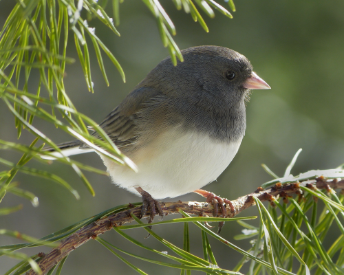
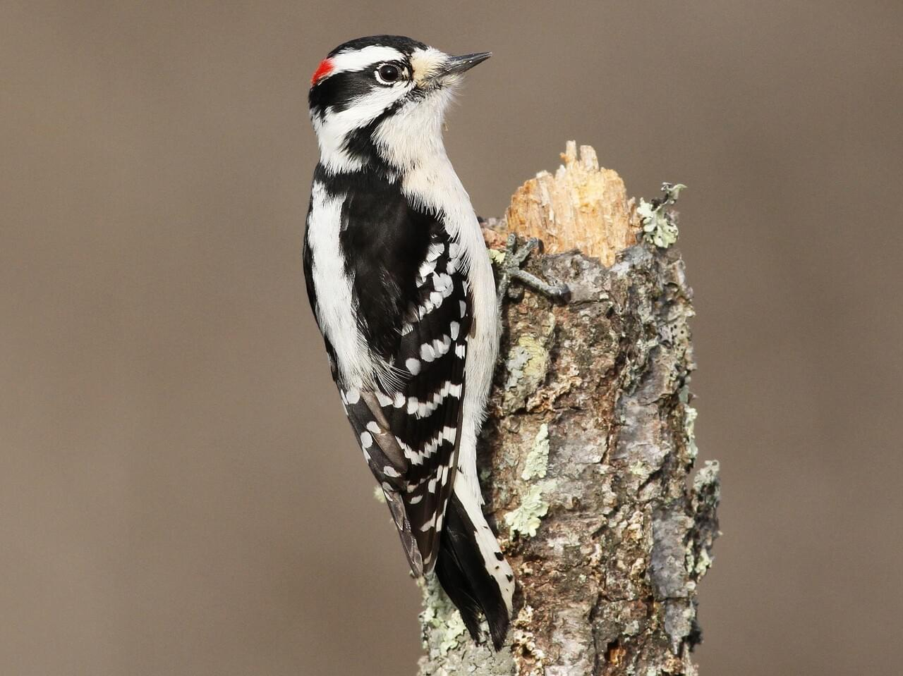
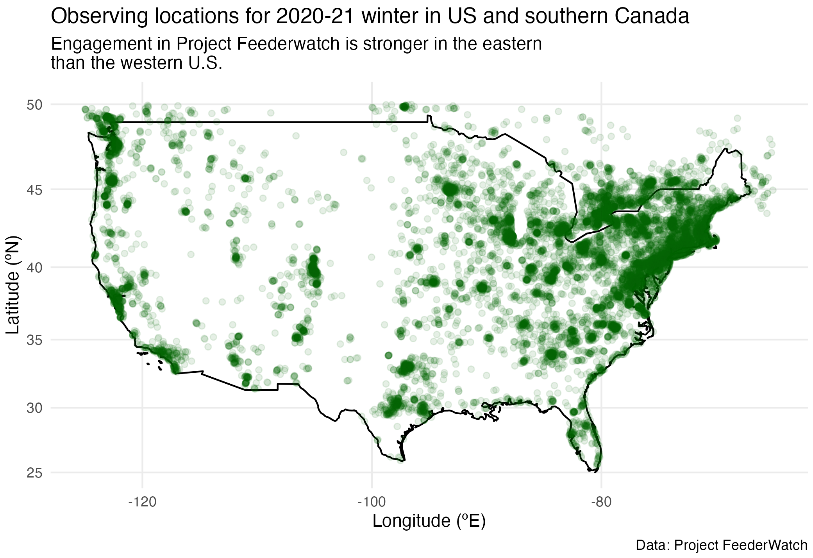
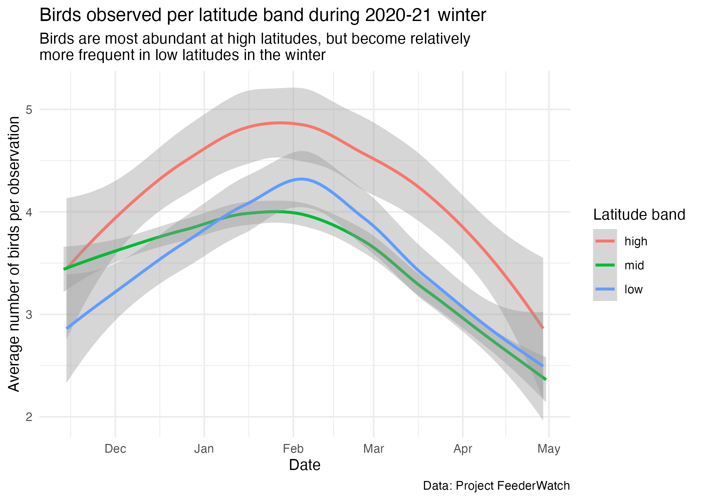
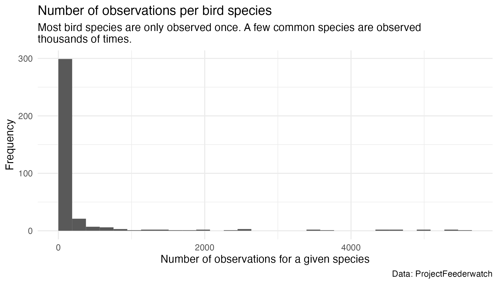
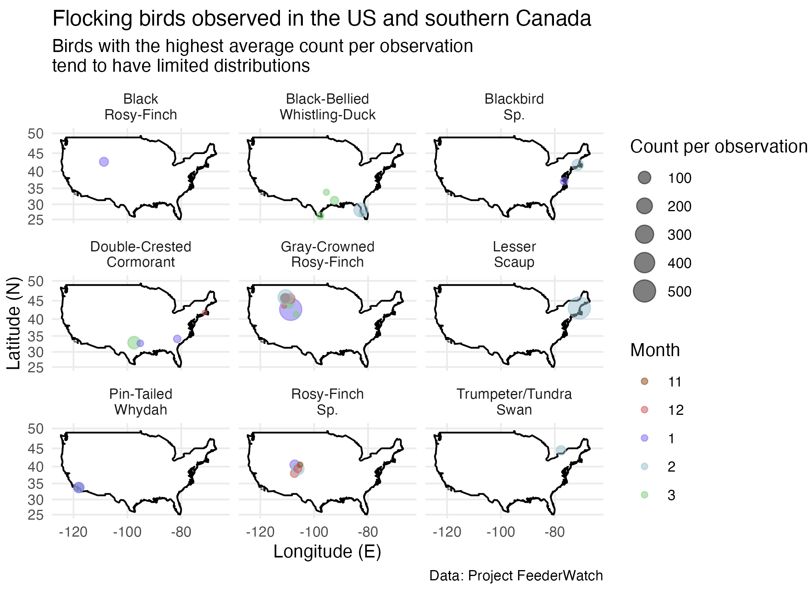

```{r, include=FALSE}
library(here)
library(tidyverse)
# Load data for dashboard
# List required files to download from TidyTuesday
rds_files <- c("feederwatch.RDS")

# Check if any of these files don't exist
if (any(!file.exists(here("data", rds_files)))) {
  dir.create(here("data"))
# if missing, download the data
feederwatch <- readr::read_csv('https://raw.githubusercontent.com/rfordatascience/tidytuesday/master/data/2023/2023-01-10/PFW_2021_public.csv')

# save the data objects as RDS files
saveRDS(feederwatch, file = here("data","feederwatch.RDS"))
}

```


```{r global}
library(here)
library(tidyverse)
library(maps)
library(mapproj)
library(lemon) 
# Load data
feederwatch <- readRDS(here("data","feederwatch.RDS"))

# had to save the species_codes dictionary manually from https://docs.google.com/spreadsheets/d/1kHmx2XhA2MJtEyTNMpwqTQEnoa9M7Il2/edit#gid=2040245914
species_codes_dd <- read_csv(here("data","FeederWatch_Data_Dictionary_Species_Codes.csv"),skip = 1)

# Preliminary pre-processing of data:
names(feederwatch) <- tolower(names(feederwatch))
names(species_codes_dd) <- tolower(names(species_codes_dd))

# Make df for state names/abbreviations 
US_state_name_abb <- as.data.frame(cbind(state_abb = state.abb, 'state/province' = state.name))
US_state_name_abb <- rbind(US_state_name_abb,c("DC","Washington, D.C."))

# CA_provinces_abb <- data_df %>%
#  filter(country=='CA') %>%
#   select('state/province') %>%
#   unique() %>%
#   arrange()

CA_province_name <- c("Quebec","Ontario","British Columbia","Manitoba","Nova Scotia","New Brunswick","Prince Edward Island","Newfoundland and Labrador","Alberta","Saskatchewan")
CA_provinces_abb <- c("QC","ON","BC","MB","NS","NB","PE","NL","AB","SK")
CA_province_name_abb <- as.data.frame(cbind(state_abb = CA_provinces_abb, 'state/province' = CA_province_name)) 

US_CA_name_abb <- rbind(US_state_name_abb, CA_province_name_abb)

# Clean data
data_df <- left_join(feederwatch, species_codes_dd, by = "species_code") %>%
  filter(valid == 1,                        # remove "invalid" observations (N = 656)
         category == "species",          # remove birds that weren't identified to the species level (N = 1194)
         latitude >= 20,
         latitude <= 50) %>%
  separate_wider_delim(subnational1_code, "-", names = c("country","state_abb")) %>%
  left_join(US_CA_name_abb, by = "state_abb") %>%
  filter(country == "US" | country == "CA") %>%
  mutate(month=factor(month, levels=c("11", "12","1","2","3","4"), labels = c("Nov", "Dec", "Jan", "Feb", "Mar", "Apr"))) %>%
  select(primary_com_name, 
            sci_name, 
            country,
            `state/province`,
            latitude, 
            longitude,
            month, 
            day, 
            year, 
            how_many)  # remove columns that probably aren't interesting to the public
# Maybe still have too many columns - may want to filter further for data table??

# Check that all US states + DC + Canadian provinces were matched correctly
# state_na_i <- which(is.na(data_df$'state/province')==1)
# data_df[head(state_na_i),]

# Prep maps of America/USA for making figures
america_map <- map_data("world", region='USA')

USA_map <-
  ggplot(america_map,
         aes(x=long, y=lat, group=group)) +
  geom_polygon(fill="white",color="black") +
  scale_x_continuous(limits = c(-125,-65)) +
  scale_y_continuous(limits = c(25, 50)) +
  coord_map() +
  theme_minimal()

states_map <- map_data("state")

# state_map <- states_map %>%
#   filter(region == "west virginia") %>%
#   ggplot(aes(x = long, y = lat)) +
#   geom_polygon(fill="white",color="black") +
#   coord_map() +
#   theme_minimal()

```

```{r setup, include=FALSE}
knitr::opts_chunk$set(warning=FALSE, message=FALSE, echo=FALSE)
library(flexdashboard)
library(DT)
library(shiny)
library(lemon)     # pretty tables with kable
```
# About

## Column 

### Purpose of this dashboard
This dashboard investigates patterns in the abundance and distribution of different species of birds in the 2020-21 winter in the United States and southern Canada. The data came from [Project FeederWatch](https://feederwatch.org/), which is a citizen science project that aims to engage individuals in North America to count birds (for as long or as little as they like) to track winter trends in bird distribution and abundance. This project has been running for more than 30 years at this point!

In this dashboard, we explore:

-   high-level overview of the observing program
-   which species were most common, and where they were found
-   species-specific distribution patterns 
-   flock sizes (for species observed at least 10 times)

This dashboard is intended for use by the general public, as well as the citizen scientists of Project FeederWatch. 


### 


# Data 

## Column 
These data were discovered and downloaded via [TidyTuesday for January 10, 2023](https://github.com/rfordatascience/tidytuesday/tree/master/data/2023/2023-01-10), but originally come from [Project FeederWatch](https://feederwatch.org/). The data dictionary is available [here](https://drive.google.com/file/d/1kHmx2XhA2MJtEyTNMpwqTQEnoa9M7Il2/view). For the purposes of this dashboard, data were filtered to focus on the continental United States and southern Canada (south of 50°N), where most observations were made. Data of questionable quality (i.e., having been identified by Project FeederWatch as being "invalid") or data that were missing critical information were omitted. A total of 96,408 unique observations were retained in this analysis.


```{r}
DT::renderDataTable({
  DT::datatable(data_df,
                caption = htmltools::tags$caption(
                  style = 'caption-side: top; text-align: Left;'),
                options = list(autoWidth = TRUE,
                               pageLength = 10,
                               scroller = TRUE,
                               scrollY = '450px'))
})

```

# Quick facts {data-orientation=rows}

## Row {data-height=250}

### Quick facts
- 370,672: The total number of birds reported!

- 361: The number of unique species 

- 177,522: The number of hours volunteers spent birdwatching!

- November 13, 2020: The date the first observation was made

- April 30, 2021: The date the last observation was made


## Row {data-width=250}

### Northern cardinal
{width="80%"}

### Dark-eyed junco
{width="80%"}

### Downy woodpecker
{width="80%"}

# Common birds

## Column {.tabset}

### Top 10 most common birds
```{r , render=lemon_print}
# Table of most common birds

commonly_sighted_birds_table <- data_df %>%
  group_by(sci_name, primary_com_name) %>%
  summarize(total = sum(how_many),
            count = n()) %>%
  arrange(desc(count)) %>%
  head(n=10) %>%
  select('Common name' = primary_com_name,
         'Scientific name' = sci_name,
         'Number of observations' = count)
commonly_sighted_birds_table

```


### Sighting numbers and locations
```{r, eval=FALSE}
# Figure 4: Commonly sighted birds
# Since this figure takes a long time to render, we'll just load in the saved figure below, but this is the code that was used to generate it:
  
common_birds_plot <- USA_map +
  geom_bin_2d(data = commonly_sighted_birds_df, 
              aes(x = longitude, y = latitude, group=NULL)) +
  scale_fill_continuous(low="lightskyblue1", 
                        high="indianred4", 
                        name="Number of \nsightings") +
  theme_minimal() + 
  labs(x="Longitude (°E)", 
       y="Latitude (°N)", 
       title="Observations of common birds in the US and southern Canada", 
       subtitle="Common bird species are most frequently observed in the Mid-Atlantic and \nNortheast regions, likely due (in part) to a sampling bias and easy bird identification", 
       color="Month") + 
  facet_wrap(vars(primary_com_name), 
             labeller = labeller(primary_com_name = label_wrap_gen(width = 10)))
#ggsave(here("figs","Commonly_sighted_birds.png"), plot=common_birds_plot, width=7, height=7, units="in")

## TODO: don't know how to center the graphic below!
```

::: {#fig-common fig-cap="Heatmap of observations for the most common birds."}
{width="60%"}
:::


# Species distributions

## Column {.sidebar}

Select a species to see when and where it was observed

```{r}
# Select the species you want to see
selectInput("bird_sp", label = "Species:",
            choices = sort(unique(data_df$primary_com_name)), selected = "Abert's Towhee")

# Select the months you want to see
selectInput("month_input", label = "Month:",
            choices = c("Nov","Dec","Jan","Feb","Mar","Apr"), multiple = TRUE, selected = "Nov")


```


## Column

### Bird sightings

```{r}
month_colors_df <- data.frame(color = c("chocolate4","indianred3","slateblue2","lightblue3","palegreen3","goldenrod1"))
month_colors_df$month <- c("Nov","Dec","Jan","Feb","Mar","Apr")
  
renderPlot({
  input_month_colors <- month_colors_df %>%
    filter(month %in% input$month_input)
    
  bird_species_df <- data_df %>%
  filter(primary_com_name == input$bird_sp,
         month %in% input$month_input)
  
  ggplot(america_map, 
         aes(x=long, y=lat, group=group)) +
  geom_polygon(fill="white",color="black") + 
  scale_x_continuous(limits = c(-125,-65)) +
  scale_y_continuous(limits = c(25, 50)) + 
  coord_map() +
  theme_minimal() +
  geom_point(data = bird_species_df,
             aes(x = longitude, y = latitude, group=NULL, size=how_many, color=month), 
             alpha=0.5) +
  scale_color_manual(values=input_month_colors$color) +  
  theme_minimal() + 
  theme(axis.text = element_text(size = 18),
        axis.title = element_text(size = 18),
                plot.title = element_text(size = 20),
                plot.caption = element_text(size = 18),
                legend.title =  element_text(size = 18))+ 
  labs(x="Longitude (°E)", 
       y="Latitude (°N)", 
       title=paste0("Reported sightings of the ", input$bird_sp, " in winter 2020-21"), 
       caption = "Data: Project FeederWatch",
       size="Count per observation")+
  guides(color = guide_legend(override.aes = list(size=5)))
})

```


# Flock sizes

## Column {.sidebar}

Select a species to see how many individuals were observed at a time

```{r}
# Select the species you want to see
# first remove birds that were only observed <10 times?
birds_obs_often <- data_df %>%
  group_by(primary_com_name) %>%
  count() %>%
  filter(n>10)

selectInput("flock_sp", label = "Species:",
            choices = sort(birds_obs_often$primary_com_name), selected = "Abert's Towhee")

sliderInput(inputId = "nbin",
            label = "Number of bins for the histogram",
            min = 5,
            max = 50,
            value = 25)

```

## Column 

### Flock sizes

```{r}

renderPlot({
flock_df <- data_df %>%
  filter(primary_com_name == input$flock_sp) %>%
  select(how_many)

num_sightings <- dim(flock_df)[1]
  
if (length(unique(flock_df$how_many))==1) {
  ggplot() +
    labs(title = paste0("All ", num_sightings," sightings of the ", input$flock_sp, " had ", unique(flock_df$how_many), " bird(s)")) +
    theme_minimal()
} else {
flock_df %>%
  ggplot() +
  geom_histogram(aes(how_many), 
                 boundary=0, 
                 closed="left",
                 bins = input$nbin) +
  labs(x = "Number of birds observed together", 
       y = "Frequency", 
       title = paste0("Histogram of observations of ", input$flock_sp)) +
  theme_minimal() +
  theme(axis.text = element_text(size = 18),
        axis.title = element_text(size = 18),
                plot.title = element_text(size = 20),
                plot.caption = element_text(size = 18),
                legend.title =  element_text(size = 18))
}
})
```

# Analysis 

## Column 

### Example analysis

```{r}
# Quick data exploration, clean up, and creation of a few useful data frames 
# glimpse(feederwatch)
# summary(feederwatch)
#length(unique(feederwatch$species_code))

# Change format for names in data dictionary:
species_codes_dd$primary_com_name <- str_to_title(species_codes_dd$primary_com_name)

# Check for outliers in space
low_lat <- which(feederwatch$latitude<0)   # length=1; this point appears to be erroneous - remove it below
high_lat <- which(feederwatch$latitude>50) # these are not erroneous, but want to narrow to US for plotting later on

# Get rid of the one low-latitude observation
feederwatch_df <- feederwatch[-low_lat,]
# hist(feederwatch$latitude)

# Add latitudinal bands to the data
feederwatch_df <- feederwatch_df %>%
  mutate(Date = ymd(paste(year, month, day, sep="-")),
         lat_band = case_when(
           latitude < 35 ~ "low",
           latitude >=35 & latitude < 45 ~ "mid",
           latitude >= 45 ~ "high"
         )) 
feederwatch_df$lat_band <- factor(feederwatch_df$lat_band, levels=c("high","mid","low"))

# Make useful dataframes:
# Total bird count per day 
bird_count_per_day <- feederwatch_df %>%
  group_by(Date, 
           lat_band) %>%
  summarize(total = sum(how_many),
            count = n(),
            std_total = total/count)

# Abundant birds: birds that have highest counts in the dataset - i.e. flocking birds
abundant_birds <- feederwatch_df %>%
  filter(latitude<50) %>%
  group_by(species_code) %>%
  summarize(total = sum(how_many),
            count = n(),
            std_total = total/count) %>%
  arrange(desc(std_total)) %>%
  head(n=9) %>%
  left_join(species_codes_dd, 
            by=join_by(species_code==species_code)) %>%
  select(species_code, 
         primary_com_name, 
         sci_name, count)

# join with species info:
abundant_birds_df <- feederwatch_df %>%
   filter(species_code %in% abundant_birds$species_code) %>%
   left_join(species_codes_dd, 
             by=join_by(species_code==species_code)) %>%
   mutate(Month=factor(month, levels=c("11","12","1","2","3","4")))


# Common birds: birds that have several records in the dataset
commonly_sighted_birds <- feederwatch_df %>%
  group_by(species_code) %>%
  summarize(total = sum(how_many),
            count = n(),
            std_total = total/count) %>%
  arrange(desc(count)) %>%
  head(n=9) %>%
  left_join(species_codes_dd, 
            by=join_by(species_code==species_code)) %>%
  select(species_code, 
         primary_com_name, 
         sci_name, 
         count)

# join with species info:
commonly_sighted_birds_df <- feederwatch_df %>%
   filter(species_code %in% commonly_sighted_birds$species_code) %>%
   left_join(species_codes_dd, 
             by=join_by(species_code==species_code)) %>%
   mutate(Month=factor(month, levels=c("11","12","1","2","3","4")))
```


**Where are birds observed?**

In order to understand trends in bird distribution and abundance, we first need to know where our observations are coming from.
Here is a figure showing the locations of observations.
The points are transparent, so denser bird-watching areas are shaded darker green.

```{r, eval=FALSE, fig.cap="Figure 1. Observing locations for Project FeederWatch 2020-21 winter."}
# Figure 1: Map of unique sighting locations

# Prep maps of America/USA for making figures
america_map <- map_data("world", region='USA')
USA_map <-
  ggplot(america_map, 
         aes(x=long, y=lat, group=group)) +
  geom_polygon(fill="white",color="black") + 
  scale_x_continuous(limits = c(-125,-65)) +
  scale_y_continuous(limits = c(25, 50)) + 
  coord_map() +
  theme_minimal()

# Identify unique sighting locations
unique_sighting_locations <- feederwatch %>%
  group_by(loc_id) %>%
  summarize(n_obs = n(),
            latitude=mean(latitude),
            longitude=mean(longitude))

# Plot unique sighting locations
obs_loc_plot <- USA_map +
  geom_point(data=unique_sighting_locations, 
             aes(x = longitude, y = latitude, group=NULL), 
             alpha=0.1, 
             color="darkgreen") +
  labs(x="Longitude (ºE)", 
       y = "Latitude (ºN)", 
       title = "Observing locations for 2020-21 winter in US and southern Canada",
       subtitle = "Engagement in Project Feederwatch is stronger in the eastern \nthan the western U.S.",
       caption = "Data: Project FeederWatch")

#ggsave(here("figs","Observing_locations.png"), plot=obs_loc_plot, width=7, height=6, units="in")
```

::: {#fig-obs-loc}
{width="65%"}
:::
Figure 1. Observing locations for Project FeederWatch 2020-21 winter.


Since most bird-watching happens in the mid-latitudes (defined here as 35-45ºN), we must standardize the number of birds by the number of observations.
The following figure indicates that birds are more abundant at higher latitudes even though there are fewer total observations.
However, birds become more common at lower latitudes (below 35ºN) from January to March.
This may be explained by migration to southern regions during the coldest months of the year.
The fact that more birds are reported within every latitudinal band during the coldest months may indicate that more birds visit feeders to obtain food during the harshest conditions of the year.


```{r, eval=FALSE, fig.cap="Figure 2. Total number of birds observed within each latitudinal band (high: >45ºN, mid: 35-45ºN, low: <35ºN)."}
# Figure 2: Bird count per latitude band
bird_lat_plot <- bird_count_per_day %>%
  ggplot(aes(x=Date, y = std_total, color = lat_band)) +   
  geom_smooth() +   # loess-smoother is default
  theme_minimal() +   
  labs(y = "Average number of birds per observation", 
       title = "Birds observed per latitude band during 2020-21 winter", 
       color = "Latitude band", 
       subtitle = "Birds are most abundant at high latitudes, but become relatively \nmore frequent in low latitudes in the winter", 
       caption = "Data: Project FeederWatch")

#ggsave(here("figs","bird_lat_plot.png"), plot=bird_lat_plot, width=7, height=5, units="in")
```

::: {#fig-obs-loc}
{width="65%"}
:::
Figure 2. Total number of birds observed within each latitudinal band (high: >45ºN, mid: 35-45ºN, low: <35ºN).

Let's now explore how often different species are observed.
A total of 361 unique species were reported, but most of these species were only observed once!
However, the most common species were observed thousands of times!
This is probably explained in part because birds are incredibly diverse, so some of these species may actually be rare, while others have may have limited distributions or be harder to identify.

```{r, eval=FALSE, fig.cap="Figure 3. Histogram of the number of observations per species."}
# Figure 3: Histogram of bird observations per species
hist_plot <- feederwatch_df %>%
  group_by(species_code) %>%
  summarize(n_obs = n()) %>%
  ggplot() +
  geom_histogram(aes(n_obs), 
                 boundary=0, 
                 closed="left") +
  labs(x = "Number of observations for a given species", 
       y = "Frequency", 
       title = "Number of observations per bird species",
       subtitle = "Most bird species are only observed once. A few common species are observed \nthousands of times.",
       caption = "Data: ProjectFeederwatch") +
  theme_minimal()

#ggsave(here("figs","hist_plot.png"), plot=hist_plot, width=7, height=4, units="in")
```

::: {#fig-obs-loc}
{width="65%"}
:::
Figure 3. Histogram of the number of observations per species.


**Which birds are most common?**

You'll probably recognize the names of some of the most common birds!
These birds were identified as "common" in the data set because they had the most observations (though not necessarily the highest total count of individuals).

```{r caption="Table 1. Most commonly observed birds in the 2020-21 winter in Project FeederWatch.", render=lemon_print}
# Table 1
commonly_sighted_birds_table <- commonly_sighted_birds %>%
  select('Common name' = primary_com_name,
         'Scientific name' = sci_name,
         'Number of observations' = count)
commonly_sighted_birds_table

```

Most of the common birds were observed throughout the U.S. (or at least where people were reportedly birdwatching, see Fig. 1).
However, some birds had more limited distributions.
For example, the blue jay and the northern cardinal were found predominantly in the eastern half of the U.S., and the black-capped chickadee was only observed in the more northern latitudes.

```{r, eval=FALSE}
# Figure 4: Commonly sighted birds
# Since this figure takes a long time to render, we'll just load in the saved figure below, but this is the code that was used to generate it:
  
common_birds_plot <- USA_map +
  geom_bin_2d(data = commonly_sighted_birds_df, 
              aes(x = longitude, y = latitude, group=NULL)) +
  scale_fill_continuous(low="lightskyblue1", 
                        high="indianred4", 
                        name="Number of \nsightings") +
  theme_minimal() + 
  labs(x="Longitude (E)", 
       y="Latitude (N)", 
       title="Observations of common birds in the US and southern Canada", 
       subtitle="Common bird species are most frequently observed in the Mid-Atlantic and \nNortheast regions, likely due (in part) to a sampling bias and easy bird identification", 
       color="Month") + 
  facet_wrap(vars(primary_com_name), 
             labeller = labeller(primary_com_name = label_wrap_gen(width = 10)))
#ggsave(here("figs","Commonly_sighted_birds.png"), plot=common_birds_plot, width=7, height=7, units="in")
```

::: {#fig-common fig-cap="Heatmap of observations for the most common birds."}
{width="65%"}
:::

Figure 4. Locations and number of sightings of common birds.


**Which birds flock and where?**

Have you heard the saying that "birds of a feather flock together"?
The birds in the figure below had the highest average abundance per observation.
This indicates to me that these birds tend to appear most often in large flocks.

```{r, eval=FALSE, fig.cap="Figure 5. Month and location for bird species with the largest average count per observation. The size of the circle is relative to the flock size, and the color indicates the month when the observation was made."}
# Figure 5: Most abundant birds (i.e. probably largest flocks)
# focus on birds in US (or below 50oN):
month_colors = c("sandybrown","indianred","slateblue3","royalblue","palegreen3")

flock_plot <- USA_map +
  geom_point(data = abundant_birds_df, 
             aes(x = longitude, y = latitude, group=NULL, size=how_many, color=Month), 
             alpha=0.5) +
  scale_color_manual(values=month_colors) +   
  theme_minimal() + 
  labs(x="Longitude (E)", 
       y="Latitude (N)", 
       title="Flocking birds observed in the US and southern Canada", 
       subtitle="Birds with the highest average count per observation \ntend to have limited distributions", 
       caption = "Data: Project FeederWatch",
       size="Count per observation") +
  facet_wrap(vars(primary_com_name), 
             labeller = labeller(primary_com_name = label_wrap_gen(width = 10)))

#ggsave(here("figs","flock_plot.png"), plot=flock_plot, width=7, height=6, units="in")
```

::: {#fig-obs-loc}
{width="65%"}
:::
Figure 5. Month and location for bird species with the largest average count per observation. The size of the circle is relative to the flock size, and the color indicates the month when the observation was made.

**Summary**

In this example analysis, we explored patterns in the distribution and abundance of birds observed through the citizen science initiative Project FeederWatch conducted in winter 2020-21.
We found that most of the observations for this program were made in the mid-Atlantic and northeast regions of the U.S.
This pattern of observation corresponded strongly with the distribution of several of the most common birds, including the American goldfinch, dark-eyed junco, downy woodpecker, and house finch.
However, flocking birds tended to have smaller ranges but a larger number of birds reported per observation.
In general, birds were most abundant in the coldest months (January-March) and at the highest latitudes (\>45ºN).


